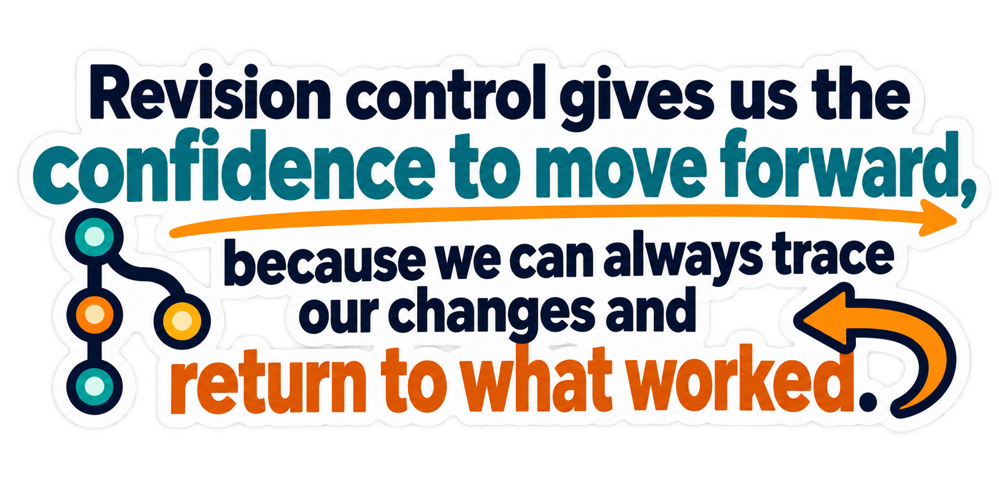

# GitHub Assignment: Repository and README Practice

## 1. Student Information

**Name:** Gridsada Phanomchoeng  
**Email:** 230079638+phanomchoeng@users.noreply.github.com

## 2. Picture

## 3. Animation

## 4. Quote

> Revision control gives us the confidence to move forward, because we can always trace our changes and return to what worked.

## 5. Video Lecture

